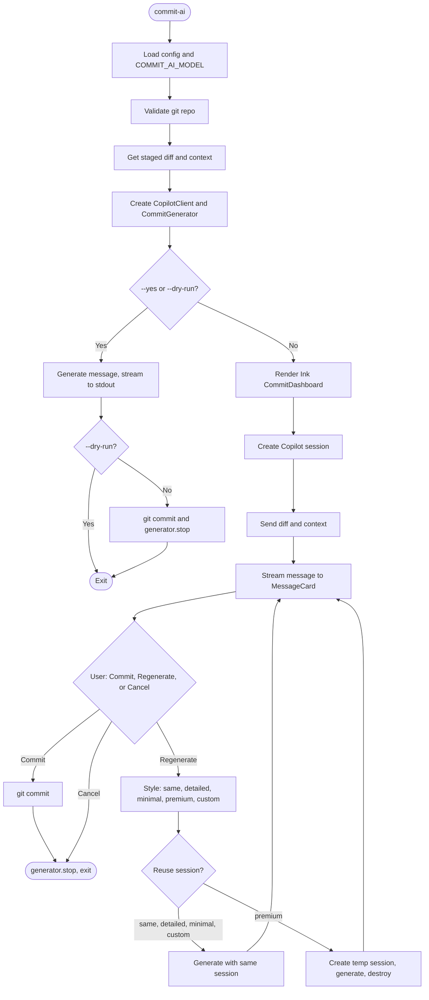

# commit-ai

> Let AI write your commit messages. Because life's too short to stare at `git commit` thinking "how do I describe this mess?"

**commit-ai** uses GitHub Copilot to turn your staged diff into proper conventional commit messages. You get a terminal dashboard: suggested message streams in, then you commit, regenerate (with different style or a custom instruction), or cancel.

## Prerequisites

- **Node.js 25+** — The project requires `node >= 25.0.0`. If you're on Node 20 or 22 (LTS), you'll need to upgrade; use `nvm use 25` or install from [nodejs.org](https://nodejs.org).
- **GitHub Copilot CLI** — Install and authenticate the [GitHub Copilot CLI](https://www.npmjs.com/package/@github/copilot-cli). The tool talks to Copilot via the API and relies on that CLI's auth.

```bash
npm install -g @github/copilot-cli
copilot auth
```

## Installation

```bash
cd commit-ai
pnpm install
pnpm link --global
```

Then run `commit-ai` from any repo.

## Usage

```bash
git add .
commit-ai
```

Interactive mode shows a dashboard: branch, file count, streaming message in a bordered card, and an action menu (Commit, Regenerate, Cancel).

### What you see while it runs

The UI walks through three steps: **Creating Copilot session…**, **Sending diff to Copilot…**, and **Generating message…**. Once the message is ready, you choose Commit, Regenerate, or Cancel. A short [terminal recording](https://github.com/charmbracelet/vhs) or GIF of the dashboard is a great addition to this README if you want to show it off.

### Regenerate options

When you pick **Regenerate**, you get:

| Option                       | What it does                                                                                                                                      |
| ---------------------------- | ------------------------------------------------------------------------------------------------------------------------------------------------- |
| **Same style**               | Regenerates with your current config (and reuses your last custom instruction if you had one).                                                    |
| **More detailed**            | Asks for a body that explains the changes, rationale, and impact.                                                                                 |
| **More concise**             | Subject line only, no body.                                                                                                                       |
| **Retry with premium model** | Uses your configured premium model (default `sonnet-3.5`) in a one-off session, then discards it. Handy when the default model isn’t quite right. |
| **Custom instruction…**      | Type free-form instructions (e.g. “add BREAKING CHANGE: …”); they’re appended to the prompt and take precedence.                                  |

### Flags

| Flag                              | Description                                                                                       |
| --------------------------------- | ------------------------------------------------------------------------------------------------- |
| `-a, --all`                       | Stage all changes, then generate                                                                  |
| `-d, --dry-run`                   | Generate message only, no commit                                                                  |
| `-e, --explain`                   | List files being committed                                                                        |
| `-v, --verbose`                   | Extra debug output                                                                                |
| `-y, --yes`                       | Commit with generated message, no prompt                                                          |
| `-s, --style <detailed\|minimal>` | Override message style                                                                            |
| `--elevation-threshold <n>`       | Elevate low-priority files when fraction of changed lines in them exceeds this (0–1; default 0.8) |
| `--no-import-collapse`            | Disable collapsing of import lines in diffs                                                       |
| `--init`                          | Print config template                                                                             |

Non-interactive (`-y` or `-d`) skips the Ink UI and prints the message to stdout.

## Configuration

Put `.commit-ai.json` in your project root or home dir:

```json
{
  "model": "grok-code-fast-1",
  "premiumModel": "sonnet-3.5",
  "conventionalCommit": true,
  "includeScope": true,
  "includeEmoji": false,
  "maxSubjectLength": 72,
  "verbosity": "normal",
  "maxDiffLength": 8000,
  "ignoreWhitespaceInDiff": false,
  "preferPremiumForLargeDiffs": false,
  "elevationThreshold": 0.8,
  "elevationMinLines": 0,
  "importCollapse": true
}
```

| Option                       | Default            | Description                                                                                                                                                                                                                                         |
| ---------------------------- | ------------------ | --------------------------------------------------------------------------------------------------------------------------------------------------------------------------------------------------------------------------------------------------- | -------------------------------------------------------------------------------------------------------------- |
| `model`                      | `grok-code-fast-1` | Copilot model used for generation. Overridden by `COMMIT_AI_MODEL` (see below).                                                                                                                                                                     |
| `premiumModel`               | `sonnet-3.5`       | Model used when you choose “Retry with premium model” in the UI. Not affected by `COMMIT_AI_MODEL`.                                                                                                                                                 |
| `conventionalCommit`         | `true`             | Use `feat:`, `fix:`, etc.                                                                                                                                                                                                                           |
| `includeScope`               | `true`             | e.g. `feat(auth):`.                                                                                                                                                                                                                                 |
| `includeEmoji`               | `false`            | When `true`, prefix the subject with a type-specific emoji: feat → ✨, fix → 🐛, refactor → ♻️, docs → 📝, style → 💄, test → ✅, chore → 🔧, perf → ⚡, ci → 👷, build → 📦.                                                                       |
| `maxSubjectLength`           | `72`               | Max length for the subject line.                                                                                                                                                                                                                    |
| `verbosity`                  | `normal`           | `minimal` (subject only) \| `normal` \| `detailed` (body with rationale).                                                                                                                                                                           |
| `maxDiffLength`              | `8000`             | Max diff size in **characters** before truncation. Increase for larger diffs (e.g. 32000); models like Copilot Chat support ~64K tokens, premium models more.                                                                                       |
| `maxDiffTokens`              | _(unset)_          | Optional. Max diff size in **tokens** (approximated from chars). When set, the effective limit is the smaller of `maxDiffLength` and this token budget. Useful to stay within model context (e.g. 12000–16000 for default model, more for premium). |
| `ignoreWhitespaceInDiff`     | `false`            | When `true`, run `git diff --staged -w` so whitespace-only changes are ignored in the prompt.                                                                                                                                                       |
| `preferPremiumForLargeDiffs` | `false`            | When `true`, use the premium model for the **first** generation when the diff exceeds the limit (truncated). The UI still suggests "Retry with premium model" when truncated.                                                                       |
| `elevationThreshold`         | `0.8`              | When the fraction of changed lines in low-priority files (e.g. data JSON, lockfiles) exceeds this, those files are elevated so they are fully or summarily included instead of dropped.                                                             |
| `elevationMinLines`          | _(unset)_          | Optional. Only consider elevation when total changed lines across all files is at least this (e.g. 50).                                                                                                                                             |
| `languageImportPatterns`     | _(built-in)_       | Optional. Map of language id to regex string for import detection (e.g. `{"python": "^(import \\                                                                                                                                                    | from .+ import )", "rust": "^use \\s+"}`). Used for import collapsing; defaults cover JS/TS, Python, Rust, Go. |
| `importCollapse`             | `true`             | When `true`, consecutive import lines in each file’s diff are collapsed to a single placeholder (e.g. “… 3 import lines …”) to save tokens. Set to `false` or use `--no-import-collapse` to disable.                                                |

**Environment variable**

- **`COMMIT_AI_MODEL`** — Overrides the `model` field from config. Useful for CI or one-off runs without editing `.commit-ai.json`.

### Large diffs

If your staged diff is very large:

- **Smart diff pipeline:** Before truncation, the tool (1) **sanitizes** the diff by stripping merge conflict markers (`<<<<<<<`, `=======`, `>>>>>>>`), (2) optionally **collapses** consecutive import lines per file (language-aware: JS/TS, Python, Rust, Go) into a short placeholder to save tokens, and (3) **truncates** with file-aware priority. The token budget from `maxDiffLength` / `maxDiffTokens` applies to the result of this pipeline.
- **Dynamic priority elevation:** If most of the changed lines are in normally low-priority files (e.g. a single large JSON data file), those files are **elevated** so they are fully or summarily included instead of dropped. Configure with `elevationThreshold` (default 0.8) and optionally `elevationMinLines`.
- **Truncation:** When over the effective limit, the tool keeps higher-priority (and elevated) files and omits or shortens others. A **summary** from `git diff --staged --stat` is always sent so the model sees which files changed and how many lines.
- **UI:** When the diff was truncated, the dashboard shows: _"Diff was truncated. For better results, try 'Retry with premium model'."_ You can enable `preferPremiumForLargeDiffs` so the first run automatically uses the premium model when the diff is over the limit.
- **Suggested limits:** For the default Copilot model (~32–64K context), a diff budget of ~12K–16K tokens (or ~40K–56K characters with `maxDiffLength`) is reasonable. For premium models with larger context, you can set `maxDiffLength` higher (e.g. 80000) or `maxDiffTokens` (e.g. 50000).

## Troubleshooting

| Issue                     | Fix                                                                                    |
| ------------------------- | -------------------------------------------------------------------------------------- |
| Copilot not authenticated | Run `copilot auth`.                                                                    |
| No staged changes         | Run `git add <files>` or use `commit-ai --all`.                                        |
| Node version errors       | Ensure Node ≥ 25 (e.g. `nvm use 25` or install from [nodejs.org](https://nodejs.org)). |

## How it works

Rough flow from “run the CLI” to “commit or exit”:



## Development

- **Run locally:** `pnpm run dev` runs `tsx src/cli.ts` — no build step; edits in `src/` apply on the next run.
- **Tests:** `pnpm test` runs the Vitest suite.
- **Session reuse:** The app keeps a single Copilot session and reuses it for Regenerate (same/detailed/minimal/custom), so the system prompt is sent once and regeneration is faster. “Retry with premium model” uses a separate temporary session and then discards it.

## FAQ

**Does this send my code to GitHub?**  
Yes. It sends your staged diff to Copilot, same as Copilot in your editor.

**Can I use it without Copilot?**  
No. It depends on the Copilot CLI and an active subscription.

**Breaking changes / footers?**  
Use Regenerate with a custom instruction (e.g. “add BREAKING CHANGE: …”) or commit with `-y` and amend with `git commit --amend`.

## License

MIT.
