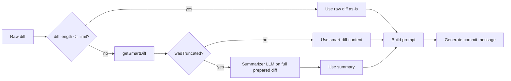

# commit-ai

> Let AI write your commit messages. Because life's too short to stare at `git commit` thinking "how do I describe this mess?"

**commit-ai** uses GitHub Copilot to turn your staged diff into proper conventional commit messages. You get a terminal dashboard: suggested message streams in, then you commit, regenerate (with different style or a custom instruction), or cancel.

## Quick Start

**Prerequisites:**

- Node.js 25+
- GitHub Copilot CLI

```bash
# Install Copilot CLI
npm install -g @github/copilot-cli
copilot auth

# Install commit-ai
cd commit-ai
pnpm install
pnpm link --global

# Use it
git add .
commit-ai
```

## Usage

Interactive dashboard streams AI-generated message → choose **Commit**, **Regenerate**, or **Cancel**.

### Common Flags

```bash
commit-ai -a          # Stage all changes first
commit-ai -y          # Auto-commit without prompt
commit-ai -d          # Dry run (generate only)
commit-ai --init      # Print config template
```

### All Flags

| Flag                              | Description                                   |
| --------------------------------- | --------------------------------------------- |
| `-a, --all`                       | Stage all changes first                       |
| `-y, --yes`                       | Auto-commit without prompt                    |
| `-d, --dry-run`                   | Generate message only                         |
| `-e, --explain`                   | List files being committed                    |
| `-v, --verbose`                   | Debug output                                  |
| `-s, --style <detailed\|minimal>` | Override message style                        |
| `--elevation-threshold <n>`       | Elevate low-priority files (0–1, default 0.8) |
| `--no-import-collapse`            | Don't collapse import lines                   |
| `--init`                          | Print config template                         |

### Regenerate Options

When you hit **Regenerate**:

- **Same style** → Current config
- **More detailed** → Adds explanation body
- **More concise** → Subject line only
- **Retry with premium model** → One-off premium session
- **Custom instruction** → Your own prompt

## Configuration

Create `.commit-ai.json` in project root or home directory:

```json
{
  "model": "grok-code-fast-1",
  "premiumModel": "sonnet-3.5",
  "conventionalCommit": true,
  "includeScope": true,
  "includeEmoji": false,
  "maxSubjectLength": 72,
  "verbosity": "normal",
  "maxDiffLength": 8000,
  "maxDiffTokens": null,
  "ignoreWhitespaceInDiff": false,
  "preferPremiumForLargeDiffs": false,
  "elevationThreshold": 0.8,
  "elevationMinLines": null,
  "importCollapse": true,
  "useSummarizationForLargeDiffs": true
}
```

### Config Reference

**Model Settings**

- `model` — Default model (`grok-code-fast-1`)
- `premiumModel` — Premium model (`sonnet-3.5`)
- `preferPremiumForLargeDiffs` — Auto-use premium for large diffs (default: `false`)

**Message Format**

- `conventionalCommit` — Use `feat:`, `fix:`, etc. (default: `true`)
- `includeScope` — Add scope like `feat(auth):` (default: `true`)
- `includeEmoji` — Prefix with emoji ✨🐛♻️ (default: `false`)
- `maxSubjectLength` — Max subject chars (default: `72`)
- `verbosity` — `minimal` | `normal` | `detailed` (default: `normal`)

**Diff Processing**

- `maxDiffLength` — Max diff chars (default: `8000`)
- `maxDiffTokens` — Max diff tokens, if set uses smaller of this and `maxDiffLength`
- `ignoreWhitespaceInDiff` — Use `git diff -w` (default: `false`)
- `importCollapse` — Collapse import lines (default: `true`)
- `useSummarizationForLargeDiffs` — When smart diff truncates, use LLM to summarize the full diff for the commit prompt (default: `true`). Set to `false` to keep truncation-only.

**Smart Prioritization**

- `elevationThreshold` — Elevate low-priority files at this fraction (default: `0.8`)
- `elevationMinLines` — Min total lines to consider elevation (optional)

**Environment Override**

- `COMMIT_AI_MODEL` — Override `model` setting

### Large Diffs

Diffs are handled in three tiers so small changes stay fast and huge diffs still get a good commit message:

1. **Small diff** (length ≤ limit) — Raw diff is sent as-is. No smart diff or summarization.
2. **Large diff** (length > limit) — Smart diff runs: sanitize (conflict markers), collapse imports (JS/TS, Python, Rust, Go), then prioritize and truncate. If the result fits, that content is used.
3. **Smart diff still too large** (truncated) — When `useSummarizationForLargeDiffs` is true (default), a single LLM call summarizes the **full** prepared diff (sanitize + collapse, no truncation) with a commit-focused prompt; that summary is then used for the commit message. If summarization fails or is disabled, the truncated diff is used and the prompt notes that the diff was truncated.



The dashboard shows "Summarizing large diff..." when the summarizer runs. If the diff was large, "Retry with premium model" is suggested; you can also set `preferPremiumForLargeDiffs: true` to use the premium model automatically for large diffs.

## Troubleshooting

| Problem                     | Solution                          |
| --------------------------- | --------------------------------- |
| "Copilot not authenticated" | Run `copilot auth`                |
| "No staged changes"         | Run `git add <files>` or use `-a` |
| Node version error          | Install Node 25+                  |

## License

MIT
